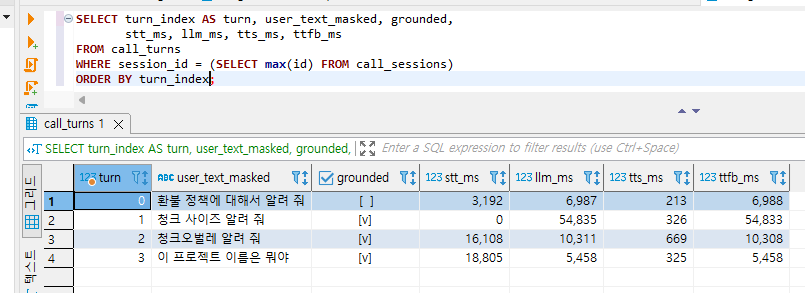
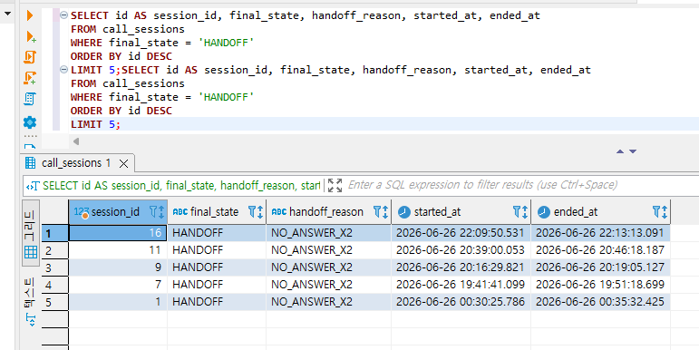
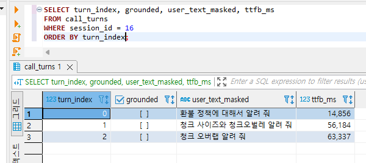
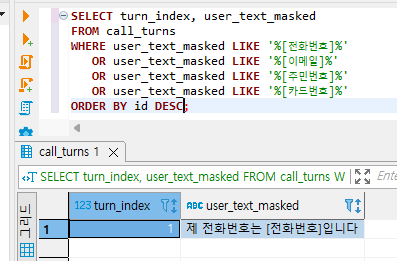

# RAG Assistant

> Spring Boot 기반 RAG 백엔드 — 검색·생성(hybrid + rerank, 출처 인용)부터 Model Router·tool calling 에이전트·음성 콜봇(근거 없으면 상담원 전환)까지

Ollama와 PostgreSQL pgvector로 업로드 문서를 검색해 답하는 Spring Boot RAG 백엔드입니다. 검색·생성·출처 인용 파이프라인을 REST API로 제공합니다.  
문서를 업로드하면 chunk → embedding → 검색 → 생성 순으로 처리하고, 답변과 함께 출처(sources)·`grounded` 여부를 반환합니다. 같은 RAG·에이전트 자산을 음성 채널로 확장해, AI가 먼저 응대하고 근거를 찾지 못하면 상담원으로 전환(handoff)하는 음성 콜봇까지 제공합니다([Voice RAG](#voice-rag-음성-콜봇)).

**스택:** Java 17, Spring Boot, Gradle, Ollama (`qwen2.5:7b`, `nomic-embed-text`), PostgreSQL + pgvector 
검색: hybrid(`pg_trgm` + RRF, `rag.hybrid-enabled` 기본 `true`) + rerank(TEI cross-encoder `bge-reranker-v2-m3`, `rag.rerank-enabled` 기본 `true`, 미기동 시 fallback) 
라우팅: Model Router — chat 추론을 다중 provider로 분기·폴백(Ollama primary + OpenAI 호환 SaaS leg, 예: Groq). 설정/요청 기준 라우팅, 실패 시 자동 폴백 (`[DECISIONS.md](docs/DECISIONS.md)` §15). 옵트인으로 **난이도 기반 라우팅**(`llm.routing-strategy: difficulty` — 분류기 `qwen2.5:3b`로 질문을 EASY/HARD 판정 → 작은/큰 모델 분기, 기본은 `fixed`) ([§16](docs/DECISIONS.md))
에이전트: tool calling 에이전트 — LLM이 필요 시 도구(`search_documents`·`list_documents`·`read_document`·`summarize_document`)를 스스로 호출해 멀티스텝으로 답을 구성. 멀티턴 대화 메모리(무상태 `messages[]`)와 스트리밍 스텝 UI(`POST /api/agent`·`/api/agent/stream`, `[DECISIONS.md](docs/DECISIONS.md)` §17·§18)
관측성: chat/agent 인터랙션을 `query_logs`에 적재하고, `GET /api/metrics/summary`로 품질(grounded/no-answer)·지연(P50/P95/P99)·토큰·추정 비용·채널별 North Star를 집계. 읽기 전용 대시보드 `/metrics.html` 제공 (`[ARCHITECTURE.md](docs/ARCHITECTURE.md)` §12)

설계·선택 이유: `[docs/DECISIONS.md](docs/DECISIONS.md)` · API·DB·설정: `[docs/ARCHITECTURE.md](docs/ARCHITECTURE.md)`

## Demo

문서 업로드 후 RAG 질의·출처·no-answer 동작 (~45초 분량).


## 실행

**필요:** JDK 17, Ollama (`http://localhost:11434`), PostgreSQL + pgvector, TEI reranker (`http://localhost:8085`, 기본 on·미기동 시 fallback)

> **의존성 등급:** Ollama·DB는 **필수**(없으면 동작 불가 → `/api/health` `DOWN`·503). TEI reranker는 **품질 의존성**으로, 미기동 시 fallback(원본 검색 순서)으로 **서비스는 계속 동작**하되 검색 품질만 떨어진다 → `/api/health`는 `DEGRADED`(200)로 표시.

> **(선택) 2nd chat provider:** Groq 등 OpenAI 호환 SaaS leg를 쓰려면 [console.groq.com](https://console.groq.com)에서 무료 키를 발급받아 `application-local.yml`에 `llm.openai-compat.enabled: true` + `api-key`를 넣는다. 미설정 시 Ollama 단독으로 동작한다. provider별 품질·지연 비교: `--rag.eval.providers=ollama-7b,groq` (아래 RAG 평가).

```bash
ollama pull qwen2.5:7b
ollama pull nomic-embed-text
# reranker 모델 (HF TEI 컨테이너가 최초 기동 시 자동 다운로드)
docker compose up -d tei-reranker   # BAAI/bge-reranker-v2-m3, http://localhost:8085
```

1. PostgreSQL 준비 — 예: `pgvector/pgvector:pg16`, `localhost:15432`, DB `rag_assistant`
  extension·테이블·인덱스는 수동 DDL (`[ARCHITECTURE.md](docs/ARCHITECTURE.md)` §6, hybrid 시 `[DECISIONS.md](docs/DECISIONS.md)` §11)
2. (선택·기본 on) TEI reranker 기동 — `docker compose up -d tei-reranker`
  미기동 시 rerank를 건너뛰고 원본 검색 순서로 동작 (fallback)
3. `cp application-local.yml.example application-local.yml` 후 DB 비밀번호 입력
4. `gradlew.bat bootRun` (또는 `./gradlew bootRun`)
5. [http://localhost:8080](http://localhost:8080) — 문서 업로드 후 채팅

Ollama·RAG 설정은 `src/main/resources/application.yml`만 수정합니다.

## API (핵심)


| Method   | Path                    | 설명                                                                                                                                                                                         |
| -------- | ----------------------- | ------------------------------------------------------------------------------------------------------------------------------------------------------------------------------------------ |
| `POST`   | `/api/documents/upload` | 문서 업로드 + 인덱싱                                                                                                                                                                               |
| `GET`    | `/api/documents`        | 문서 목록                                                                                                                                                                                      |
| `DELETE` | `/api/documents/{id}`   | 문서 삭제                                                                                                                                                                                      |
| `POST`   | `/api/chat`             | RAG 응답 (JSON). 선택 `provider` 지정 시 해당 leg 우선, 응답에 `provider` 포함                                                                                                                             |
| `POST`   | `/api/chat/stream`      | RAG 스트리밍 (SSE). default 라우팅(요청 provider 미적용·폴백 없음)                                                                                                                                         |
| `POST`   | `/api/agent`            | tool calling 에이전트. LLM이 도구(검색·목록·본문 읽기·요약)를 호출해 멀티스텝 응답 (`answer`·`sources`·`grounded`·`steps`·`stopReason`). 선택 `provider`·멀티턴 `messages[]` (`[DECISIONS.md](docs/DECISIONS.md)` §17·§18) |
| `POST`   | `/api/agent/stream`     | 에이전트 스트리밍 (SSE). `step`(도구 호출/결과) → `delta`(최종 답) → `done` 순서, 빈 `message`는 스트림 전 400 ([§18](docs/DECISIONS.md))                                                                           |
| `GET`    | `/api/health`           | 앱 + 의존성 상태. db DOWN 또는 chat provider 0개 UP → `DOWN`·503, reranker만 DOWN → `DEGRADED`·200. `dependencies`에 provider별 상태                                                                     |
| `GET`    | `/api/metrics/summary`  | 지표 집계. 기간·채널(`chat`·`agent`·`voice`·`all`)별 품질(grounded/no-answer)·지연(P50/P95/P99)·토큰·추정 비용·신뢰(handoff/완료율)·North Star. `metrics.enabled=false`면 404 (`[ARCHITECTURE.md](docs/ARCHITECTURE.md)` §12) |
| `GET`    | `/api/metrics/timeseries` | 추이(드리프트). 기간을 `bucket`(day/week/hour)으로 쪼갠 버킷별 품질·지연·토큰·검색점수 시계열. 대시보드 추이 차트용 |


`local` 프로필: Swagger [http://localhost:8080/swagger-ui.html](http://localhost:8080/swagger-ui.html), debug API (`/api/debug/...`)

## MCP Server (stdio)

기존 RAG 도구 4종(`search_documents`·`list_documents`·`read_document`·`summarize_document`)을 [Model Context Protocol](https://modelcontextprotocol.io) 도구로 노출합니다. Claude Desktop·Cursor·Claude Code 같은 MCP 클라이언트에서 이 RAG 백엔드를 직접 호출해 **출처 포함 응답**을 받을 수 있습니다.

- 전송: **stdio** (JSON-RPC 2.0 직접 구현, 외부 의존성 추가 0)
- 격리: `mcp-stdio` 프로파일에서만 동작 — 기존 웹 동작에 영향 없음
- 지원 메서드: `initialize` · `notifications/initialized` · `tools/list` · `tools/call` · `ping`
- `initialize`/`tools/list`/`ping` 핸드셰이크는 **DB 없이도 동작**(`tools/call` 실제 실행만 DB·Ollama 기동 전제)
- 기존 agent tool registry를 재사용해 MCP 전송·프로토콜 어댑터 계층만 추가

**빌드 후 클라이언트 등록** (`claude_desktop_config.json`, Cursor `mcp.json` 등):

```bash
gradlew.bat bootJar   # build/libs/rag-assistant-0.0.1-SNAPSHOT.jar
```

```json
{
  "mcpServers": {
    "rag-assistant": {
      "command": "java",
      "args": [
        "-jar",
        "<repo>/build/libs/rag-assistant-0.0.1-SNAPSHOT.jar",
        "--spring.profiles.active=mcp-stdio,local",
        "--spring.config.additional-location=optional:file:<repo>/"
      ]
    }
  }
}
```

> `<repo>`**는 절대 경로로 치환**(예: `D:/cursor/rag-assistant`). MCP 클라이언트는 임의의 작업 디렉터리에서 jar를 실행하므로 jar·설정 경로 모두 절대 경로를 권장합니다.
>
> `tools/call`**(DB 의존)에** `,local` **+** `config.additional-location`**이 필요한 이유:** DB 비밀번호는 git 제외 파일 `application-local.yml`(프로젝트 루트, `on-profile: local`)에 있습니다. `mcp-stdio` 단독 실행은 이 파일을 로드하지 않아 `Failed to obtain JDBC Connection`이 납니다. `,local`로 해당 프로파일을 켜고, `config.additional-location`으로 클라이언트 cwd와 무관하게 그 파일을 찾게 합니다. (`initialize`/`tools/list` 핸드셰이크만 볼 거면 `--spring.profiles.active=mcp-stdio`만으로 충분합니다.)
>
> stdout은 JSON-RPC 전용이며, 로그는 `logback-spring.xml`의 `mcp-stdio` 프로파일에서 stderr로 분리해 프로토콜 오염을 막습니다.

**로컬 스모크 테스트** (DB 없이 핸드셰이크 확인, Windows `cmd`):

```bat
echo {"jsonrpc":"2.0","id":1,"method":"initialize","params":{"protocolVersion":"2024-11-05","capabilities":{}}}> in.txt
echo {"jsonrpc":"2.0","id":2,"method":"tools/list"}>> in.txt
java -jar build\libs\rag-assistant-0.0.1-SNAPSHOT.jar --spring.profiles.active=mcp-stdio < in.txt
```

> DB 의존 도구(`list_documents`·`search_documents` 등)까지 스모크하려면 Postgres·Ollama 기동 후 위 jar 인자에 `,local`과 `--spring.config.additional-location=optional:file:<repo>/`를 더해 실행합니다.


## Voice RAG (음성 콜봇)

> 브라우저 마이크 → STT(브라우저 Web Speech, 비면 Groq Whisper 폴백) → tool calling agent(멀티턴·RAG) → TTS 음성 응답.
> 못 풀면 **상담원 전환(handoff)**, 통화는 **구간별 지연·PII 마스킹** 로그로 남습니다.

기존 RAG·tool-calling 자산을 음성·실시간 도메인으로 확장한 PoC입니다. 신규는 WebSocket Voice Gateway(`/ws/voice`) 하나이며 agent·RAG·DB는 그대로 재사용합니다.

- **멀티턴:** 세션 대화 이력 유지 → 후속 질문("그게 다인가요") 맥락 연결(agent 경유)
- **상태머신:** `IDLE→LISTENING→THINKING→SPEAKING→(HANDOFF)` + 상태별 UI(로딩/빈/오류/권한)
- **상담원 전환:** `grounded=false` 2회 연속 → 환각 대신 handoff
- **수치화:** 턴별 `stt_ms/llm_ms/tts_ms/ttfb_ms`를 `call_turns`에 적재 → 병목 분석
- **개인정보 마스킹:** 전화/이메일/주민·카드번호를 마스킹 후 저장(`user_text_masked`)
- **폴백:** LLM(Groq→Ollama)·TTS(Google→브라우저)·**STT(브라우저 Web Speech→Groq Whisper)**. STT는 브라우저 인식이 1차이며, 인식이 비었을 때만 서버가 발화 오디오를 Groq로 폴백 전사한다(`voice.stt.enabled`, 기본 off면 브라우저 단독). 정상 환경에서는 클라우드를 호출하지 않아 환각·지연·쿼터 소모를 피하고, Web Speech가 막히는 환경에서는 클라우드 폴백이 받쳐 준다


### 통화 로그 (재현 가능한 백엔드 증거)

실제 통화의 `call_turns`/`call_sessions` 적재 결과 — 음성 없이도 동작을 검증할 수 있는 구조화 로그입니다.

**① 턴별 지연·근거 판정** — 답할 수 있으면 답하고(`grounded=true`), 못 찾으면 정직하게 `false`. 턴별 STT/LLM/TTS/TTFB(ms)를 `call_turns`에 적재.



**② 상담원 전환(handoff)** — `grounded=false` 2회 연속 → 환각 대신 전환. `call_sessions.final_state=HANDOFF` / `handoff_reason=NO_ANSWER_X2`로 영속화되고, 해당 세션 턴 내역에서 원인이 보입니다.





**③ 개인정보(PII) 마스킹** — 저장 전 전화·이메일·주민·카드번호를 치환. 원문 `010-1234-5678` → 저장값 `[전화번호]`.



> 위 지연(`llm_ms`/`ttfb_ms`)은 로컬 `qwen2.5:7b` 콜드 로드 기준이라 수십 초까지 늘 수 있습니다. `llm.default-provider: groq` 사용 시 첫 응답이 ~1.5초 수준으로 단축됩니다([RAG 평가](#rag-평가) 참조).

**실행:** RAG 환경 기동 후 `gradlew.bat bootRun` → [http://localhost:8080/voice.html](http://localhost:8080/voice.html)  
(발화 구간 감지는 **Chrome/Edge**(Web Speech) 권장, LLM은 `llm.default-provider: groq` 권장. 클라우드 STT 폴백은 `voice.stt.enabled: true` + Groq 키(`llm.openai-compat.api-key` 재사용) 시 활성(브라우저 인식이 빌 때만 사용), 미설정 시 브라우저 STT 단독. Google TTS 미설정 시 브라우저 TTS 폴백.)  
`call_sessions`·`call_turns`는 앱 시작 시 `schema.sql`로 자동 생성됩니다(`IF NOT EXISTS`).

WebSocket 이벤트·DB 스키마·측정 상세: `[docs/ARCHITECTURE.md](docs/ARCHITECTURE.md)` (§5 Voice · §6 call_sessions/call_turns)

## RAG 평가

고정 질문 세트(`eval/questions.json`)로 RAG 파이프라인 품질을 **자동 측정**합니다.
각 문항의 `score`·`grounded`·`sources`·`noAnswer`를 룰 기반으로 채점해 JSON/Markdown 리포트로 남깁니다.

> **최신 결과(10문항, 재현 가능):** RAG **on 20/20** vs **off 0/20** (`[eval/reports/compare-latest.md](eval/reports/compare-latest.md)`).
> provider 비교: ollama-7b **20/20**(~~62s) · ollama-1b **11/20**(~~8s) · groq **18/20**(~1.5s) (`[compare-providers.md](eval/reports/compare-providers.md)`) — 로컬 큰 모델이 최고 품질, groq가 최저 지연.

```bash
# RAG on (검색 + no-answer 정책)
gradlew.bat bootRun --args="--rag.eval.enabled=true --rag.eval.mode=RAG_ON"
# RAG off (LLM만, 대조군)
gradlew.bat bootRun --args="--rag.eval.enabled=true --rag.eval.mode=RAG_OFF"
# provider 비교 (한 번에 실행 → compare-providers.md 생성)
gradlew.bat bootRun --args="--rag.eval.enabled=true --rag.eval.mode=RAG_ON --rag.eval.providers=ollama-7b,ollama-1b,groq"
```

> **느린 로컬 모델 벤치마크:** 큰 모델(예: `qwen2.5:7b`)은 콜드 로드 시 기본 read timeout(120s)을 넘길 수 있다. `--ollama.timeout-ms=300000`로 상향하거나 측정 전 `ollama run qwen2.5:7b "hi"`로 워밍업한다. 한 provider가 timeout으로 실패해도 나머지 provider는 끝까지 실행되고(실패 문항은 0점 기록), 성공한 결과가 2개 이상이면 `compare-providers.md`가 생성된다.
>
> **측정 타당성:** `--rag.eval.providers`로 provider를 강제하면 해당 leg만 호출하고 **fallback하지 않는다**(strict). 즉 비교표의 각 행은 "순수 그 provider"의 결과이며, groq 호출이 실패해도 로컬 모델로 조용히 폴백되어 수치가 섞이지 않는다(실패 시 그 provider의 실패로 0점 기록). 운영 API(`/api/chat`)의 `provider` 지정은 기존대로 "우선 + 폴백"을 유지한다.
>
> **무료 SaaS rate-limit 회피(throttle):** 무료 티어(예: Groq `llama-3.1-8b-instant`는 TPM 6K)는 RAG 프롬프트(source 다수)가 토큰이 커서 10문항을 연속으로 던지면 분당 토큰 한도에 걸려 `429`가 난다. `--rag.eval.delay-ms`로 문항 사이 간격을 주면 분당 한도 아래로 맞춰 완주할 수 있다. 간격은 측정 구간 밖이라 `avgLatencyMs`에는 포함되지 않는다.
>
> - `--rag.eval.delay-ms=30000` — 모든 provider 문항 사이 30초.
> - `--rag.eval.throttle-providers=groq` — 간격을 특정 provider(콤마 구분)에만 적용. 생략 시 전체 적용. 로컬 leg(ollama)는 rate-limit이 없으므로 보통 groq만 지정한다.
>
> ```bash
> # 7b·1b는 풀스피드, groq만 30초 간격으로 한 번에 비교
> gradlew.bat bootRun --args="--rag.eval.enabled=true --rag.eval.mode=RAG_ON --rag.eval.providers=ollama-7b,ollama-1b,groq --rag.eval.delay-ms=30000 --rag.eval.throttle-providers=groq"
> ```

산출물 (`eval/reports/`):

- `latest-rag-on.{json,md}` / `latest-rag-off.{json,md}` — 모드별 최신 결과
- `compare-latest.md` — on/off 점수 비교표 (둘 다 실행 시)
- `latest-rag-on-{provider}.{json,md}` — provider 강제 실행 결과 (예: groq, ollama-7b)
- `compare-providers.md` — provider 비교표 (≥2개 실행 시)
- `runs/{timestamp}_{MODE}.{json,md}` — 실행 이력 (gitignore, 로컬 튜닝용)

수동 측정 기록 (자동화 이전):

- `[docs/RAG_EVAL_v1.md](docs/RAG_EVAL_v1.md)` — baseline
- `[docs/RAG_EVAL_v1.1.md](docs/RAG_EVAL_v1.1.md)` — FAQ chunk·prompt 개선
- `[docs/RAG_EVAL_v2.md](docs/RAG_EVAL_v2.md)` — RAG on vs off (자동 재현 기준)


## 한계

- chat은 다중 provider 라우팅·폴백 지원(Ollama primary + OpenAI 호환 SaaS leg). 단 **임베딩은 Ollama 단일**(차원 768 고정)이라 Ollama 없이는 검색 단계가 동작하지 않음
- SaaS leg는 키 설정(`application-local.yml`) 시에만 활성. 헬스의 SaaS 상태는 config 수준(실제 도달성 핑 아님), 스트리밍은 폴백 없이 default leg만 사용
- 클라우드 배포 없음 (로컬 실행)
- PDF는 텍스트 레이어만 지원 (스캔본 OCR 없음)
- DB schema migration은 repo에 없음 (로컬 수동 DDL)

